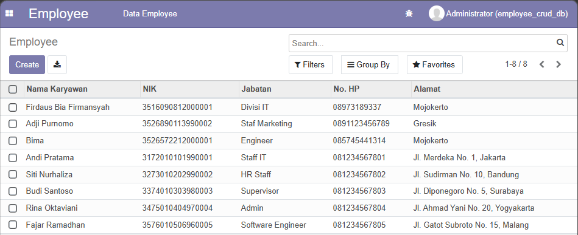
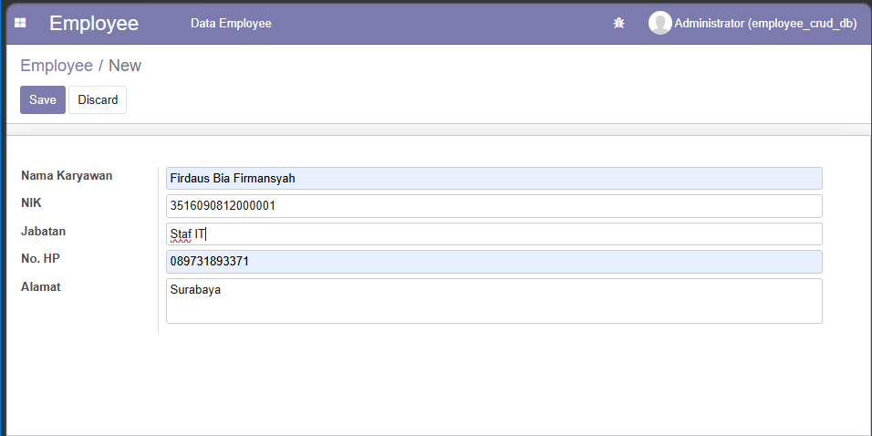
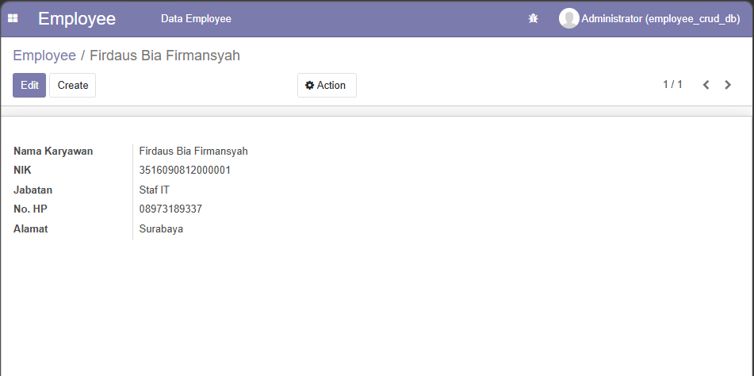
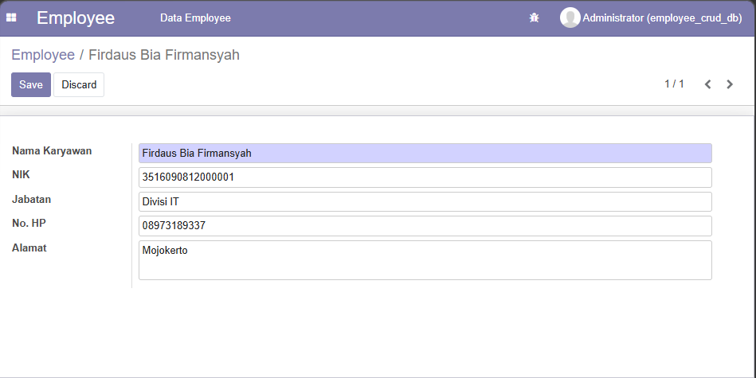
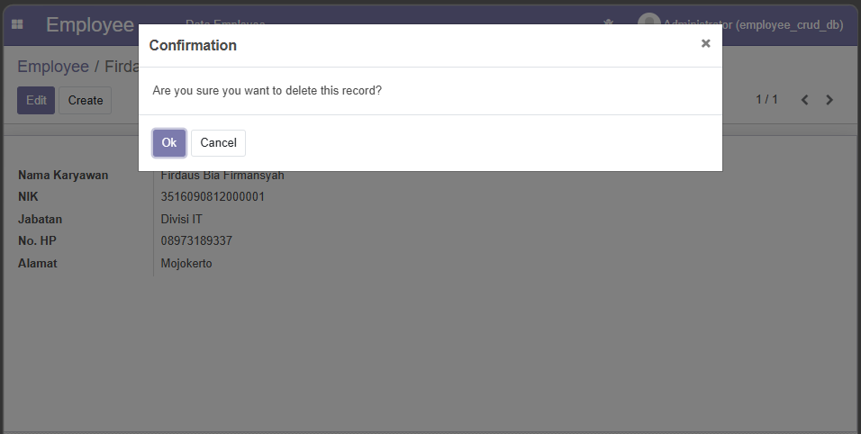

# Employee CRUD Odoo v14

Aplikasi sederhana untuk mengelola data karyawan menggunakan Odoo v14.

## Fitur
- Create data karyawan

- Read data karyawan

- Update data karyawan

- Delete data karyawan

## Cara Install
1. Copy folder modul ke folder addons Odoo, misalnya:
    - addons/
    - custom_addons/
2. Restart Odoo
3. Update Apps List
4. Install modul "Employee CRUD"